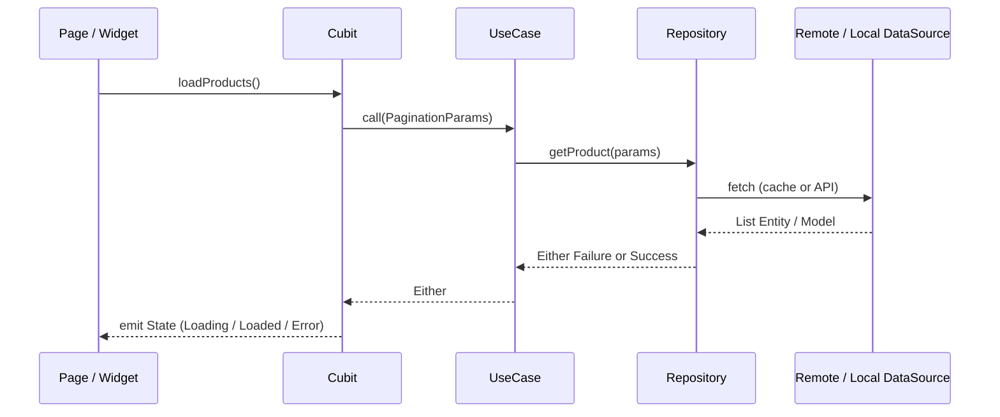

# Flutter Clean Architecture Template

A production-oriented Flutter starter built on **feature-first Clean Architecture**, with clear layer separation, **Cubit/BLoC** state management, and **GetIt** dependency injection.

Use it as a team foundation or an open-source template that scales without restructuring the project every time you add a feature.

---

## Table of Contents

- [Why This Architecture?](#why-this-architecture)
- [Architecture Overview](#architecture-overview)
- [Project Structure](#project-structure)
- [Data Flow](#data-flow)
- [Requirements](#requirements)
- [Quick Start](#quick-start)
- [Common Commands](#common-commands)
- [Adding a New Feature](#adding-a-new-feature)
- [Core Packages](#core-packages)
- [Testing](#testing)

---

## Why This Architecture?

| Problem | Solution in this template |
|--------|-------------------------|
| UI coupled to API and storage | `presentation` → `domain` → `data` layers with contracts (interfaces) |
| Hard-to-test business logic | Replaceable, testable Use Cases and Repositories |
| Unorganized project growth | Each feature in its own folder with `{feature}_injection.dart` |
| Inconsistent network errors | `Either<Failure, T>` via `dartz` and `safeCall` |
| Multiple environments (dev/prod) | Flavors + `main_dev` / `main_prod` |

---

## Architecture Overview

**Pattern:** Feature-first Clean Architecture  
**State management:** `flutter_bloc` (Cubit)  
**Dependency injection:** `get_it` (Service Locator)  
**Routing:** `go_router` with `StatefulShellRoute` (bottom navigation)  
**Networking:** `dio` behind the `ApiConsumer` abstraction  
**Storage:** Hive (local cache), SharedPreferences, Secure Storage  

### Layers and Responsibilities

```
┌─────────────────────────────────────────────────────────┐
│  presentation   │  Pages, Widgets, Cubit, State         │
├─────────────────┼───────────────────────────────────────┤
│  domain         │  Entities, Repository (abstract),     │
│                 │  Use Cases                            │
├─────────────────┼───────────────────────────────────────┤
│  data           │  Models, DataSources, RepositoryImpl  │
└─────────────────────────────────────────────────────────┘
         ▲                              │
         │   domain does not depend     │ data depends on domain
         │   on data or UI              ▼
```

- **Presentation:** Renders UI and calls Use Cases through Cubits only.
- **Domain:** Business rules and contracts; no Flutter or Dio imports.
- **Data:** Implements contracts (API, cache, Model ↔ Entity mapping).

**Dependency direction:** inward — `presentation` → `domain` ← `data`.

### Reference Example (Home Feature)

| File | Role |
|------|------|
| `product_cubit.dart` | UI state + calls `GetProductUseCase` |
| `get_product_usecase.dart` | Product-fetch business logic |
| `home_repository.dart` | Repository contract |
| `home_repository_impl.dart` | Local cache then network via `safeCall` |
| `home_remote_data_source.dart` | HTTP requests |
| `home_local_data_source.dart` | Hive |

---

## Project Structure

```
lib/
├── main_dev.dart / main_prod.dart    # Entry points per flavor
├── main_common.dart                  # Shared bootstrap (DI, flavor, runApp)
├── my_app.dart                       # MaterialApp.router + theme
├── root.dart                         # Shell + bottom navigation
│
├── config/                           # App-wide setup (not a feature)
│   ├── env/                          # Envied (.env)
│   ├── routing/                      # GoRouter + route names
│   └── theme/                        # Colors, fonts, ThemeData
│
├── core/                             # Shared infrastructure
│   ├── constants/
│   ├── di/injection_container.dart   # Core registration + initFeature calls
│   ├── errors/                       # Failure + Dio handling
│   ├── network/                      # ApiConsumer, DioConsumer, NetworkInfo
│   ├── storage/
│   ├── localization/
│   ├── utils/                        # safeCall, logger
│   └── extensions/
│
├── features/                         # Each feature = 3 layers + injection
│   ├── home/
│   │   ├── data/
│   │   ├── domain/
│   │   ├── presentation/
│   │   └── home_injection.dart
│   ├── cart/
│   ├── profile/
│   └── theme/
│
├── shared/                           # Cross-feature code
│   ├── use_cases/                    # Base UseCase<T, Param>
│   ├── models/                       # Pagination
│   ├── widgets/
│   ├── navigation/
│   └── wrappers/                     # Localization, providers, AppWrapper
│
└── generated/                        # Generated code (i18n, env)
```

```
assets/
└── translations/          # ar.json, en.json (easy_localization)

bricks/feature/            # Mason brick for a full feature scaffold
```

---

## Data Flow



1. **Cubit** calls the **UseCase** and never talks to Dio directly.
2. **Repository** decides whether to read from cache (Hive) or the network.
3. **safeCall** catches exceptions and returns `Left(Failure)` or `Right(data)`.

---

## Requirements

- Flutter SDK `>=3.11.5`
- Dart `>=3.11.5`
- Environment file: `lib/config/env/.env` (see fields below)

Example `.env`:

```env
API_KEY=your_api_key
BASE_URL=https://your-api.example.com
```

---

## Quick Start

```bash
# Install dependencies
flutter pub get

# Generate env (after editing .env)
dart run build_runner build --delete-conflicting-outputs

# Run development flavor
flutter run --flavor dev -t lib/main_dev.dart

# Run production flavor
flutter run --flavor prod -t lib/main_prod.dart
```

> On **Android**, pass `--flavor` because `dev` and `prod` are defined in `android/app/build.gradle.kts`.  
> On **iOS**, configure matching Schemes/Configurations when you add them.

---

## Common Commands

### Flavors (run and build)

```bash
# Debug
flutter run --flavor dev -t lib/main_dev.dart
flutter run --flavor prod -t lib/main_prod.dart

# APK
flutter build apk --flavor dev -t lib/main_dev.dart
flutter build apk --flavor prod -t lib/main_prod.dart

# App Bundle
flutter build appbundle --flavor prod -t lib/main_prod.dart
```

### Code generation

```bash
# Envied — after editing lib/config/env/.env
dart run build_runner build --delete-conflicting-outputs

# Hive adapters (e.g. product_entity)
dart run build_runner build --delete-conflicting-outputs

# Translation keys (easy_localization)
dart run easy_localization:generate \
  --source-dir ./assets/translations \
  -f keys \
  -o locale_keys.g.dart

# FlutterGen assets (if enabled)
dart pub global activate flutter_gen
fluttergen
```

### Generate a feature with Mason

```bash
dart pub global activate mason_cli
mason get

# Example
mason make feature --feature_name order --entity_name Order
```

This scaffolds 11 files (data / domain / presentation + injection). See [`bricks/feature/README.md`](bricks/feature/README.md) for details.

---

## Adding a New Feature

### Quick path (Mason)

After `mason make feature ...`, complete **3 steps**:

1. **Endpoint** in `lib/core/constants/api_endpoints.dart`
2. **DI** — call `initYourFeature()` inside `initCore()` in `injection_container.dart`
3. **Routing** — add a `GoRoute` in `lib/config/routing/app_router.dart`

### Manual path

Copy an existing feature structure (e.g. `home`), rename files, then register injection and routes as above.

### Feature checklist

- [ ] Entity in `domain/entities`
- [ ] Model extends Entity + `fromJson` / `toJson`
- [ ] Repository (abstract) + RepositoryImpl + `safeCall`
- [ ] RemoteDataSource (+ Local if needed)
- [ ] UseCase extends `UseCase<T, Param>` from `shared/use_cases`
- [ ] Cubit + States
- [ ] Page with `BlocProvider` and `sl<YourCubit>()`
- [ ] `{feature}_injection.dart` wired in `initCore`

---

## Core Packages

| Category | Packages |
|----------|----------|
| Architecture | `dartz`, `equatable`, `get_it` |
| State | `flutter_bloc` |
| Networking | `dio`, `connectivity_plus`, `internet_connection_checker_plus` |
| Routing | `go_router` |
| Storage | `hive`, `hive_flutter`, `shared_preferences`, `flutter_secure_storage` |
| UI / UX | `flutter_screenutil`, `cached_network_image`, `shimmer`, `infinite_scroll_pagination` |
| Environment | `flutter_flavor`, `envied` |
| i18n | `easy_localization` |
| Other | `logger`, `flutter_native_splash`, `flutter_launcher_icons` |

---

## Testing

```bash
flutter test
```

The structure keeps logic in Use Cases and Repositories, which makes **unit tests** and **mocked DataSources** straightforward. Add tests under `test/` per Use Case or Cubit as needed.

---

## Design Philosophy

1. **Feature-first** — everything specific to orders or products lives under `features/order`, not in large generic folders.
2. **Pure domain** — no imports from `data` or `presentation` inside `domain`.
3. **Explicit errors** — `Either` instead of throwing exceptions in the UI layer.
4. **Swappable infrastructure** — replace Dio or storage without touching Cubits.
5. **Developer experience** — Mason + documented commands in `main_common.dart` to reduce copy-paste.

